# ✨ LLM Bridge - マルチ LLM クライアント ✨

_Ollama、LM Studio、Claude、OpenAIをサポートするマルチプラットフォームLLMクライアント_

[한국어](README-ko.md) • [English](README.md) • [日本語](README-jp.md) • [中文](README-cn.md)

# LLM Bridge

LLM Bridgeは、Ollama、LM Studio、Claude、OpenAIなど、様々なLLMサービスに接続できるマルチプラットフォームクライアントアプリです。ソースコードをダウンロードしてビルドするか、App StoreからLLM Bridgeアプリをダウンロードできます。

## 紹介

LLM Bridgeは、複数のLLMプラットフォームをサポートする多機能なクライアントです：

* **Ollama**: ローカルでLLMを実行するためのオープンソースソフトウェア
* **LM Studio**: 様々なモデルをサポートするローカルLLMプラットフォーム
* **Claude**: Anthropicの高度なAIモデル
* **OpenAI**: GPTモデルを含む先駆的なAIプラットフォーム

## 主な機能

* **複数LLMプラットフォームサポート**：
  * OllamaによるローカルLLMアクセス（`http://localhost:11434`）
  * LM Studio統合（`http://localhost:1234`）
  * Claude APIサポート - APIキー必要
  * OpenAI APIサポート - APIキー必要
* **選択的サービス表示**: モデル選択メニューで表示するLLMサービスを選択
* **リモートLLMアクセス**: IPアドレスを通じてOllama/LM Studioホストに接続
* **カスタムプロンプト**: カスタム指示設定のサポート
* **様々なオープンソースLLMサポート**（Deepseek、Llama、Gemma、Qwen、Mistralなど）
* **カスタマイズ可能な指示設定**
* **高度なモデルパラメータ**: 直感的なスライダーによるTemperature、Top P、Top K制御
* **接続テスト**: 内蔵サーバー接続状態チェッカー
* **マルチフォーマットファイルサポート**: 画像、PDF文書、テキストファイル
* **画像認識サポート**（サポートするモデルのみ）
* **直感的なチャット型UI**
* **会話履歴**: チャットセッションの保存と管理
* **韓国語、英語、日本語、中国語サポート**
* **Markdown形式サポート**

## プラットフォームサポート

### 🖥️ macOSサポート

macOS版LLM Bridgeは、デスクトップ環境に最適化されたネイティブmacOSアプリとして開発されています。

#### macOS主な特徴:
- **ローカルLLM**: ローカルLLM接続
- **ネイティブmacOS UI**: macOSデザインガイドラインに従ったインターフェース
- **サイドバーナビゲーション**: 会話リストとメインチャットエリアを分離した効率的なレイアウト
- **モデル選択メニュー**: 上部ツールバーからの簡単なモデル選択と変更
- **高度な設定**: 詳細なLLMパラメータ調整とサーバー設定
- **ファイルドラッグ&ドロップ**: 画像とドキュメントの簡単なアップロード
- **キーボードショートカット**: 生産性を向上させるショートカット

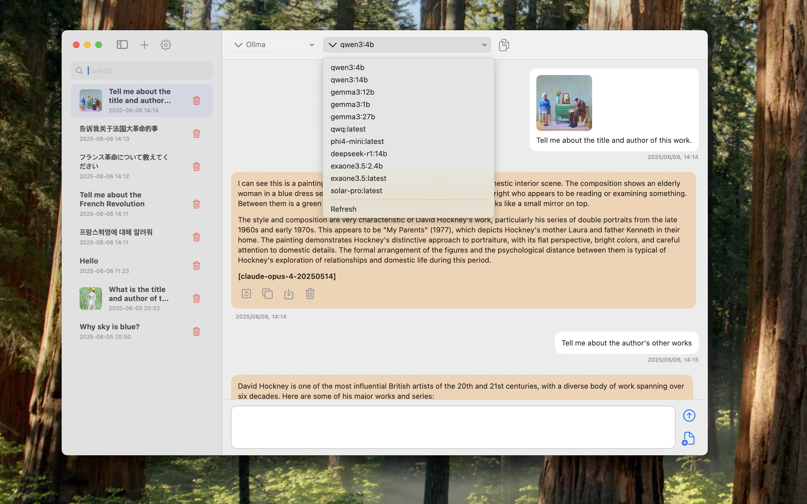

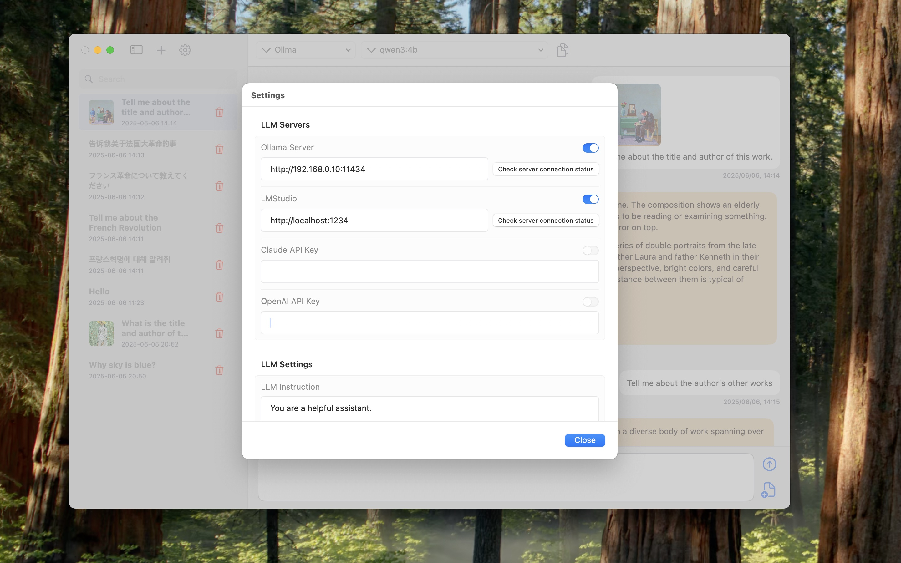

### 📱 iOSサポート

iOS版LLM Bridgeは、モバイル環境に最適化されたインターフェースを提供します。

#### iOS主な特徴:
- **ローカルLLM**: ローカルLLM接続
- **モバイル最適化UI**: タッチインターフェースに最適化されたデザイン
- **タブベースナビゲーション**: 簡単なナビゲーションのための直感的なタブ構造
- **スワイプジェスチャー**: メッセージ削除と管理
- **カメラ統合**: 写真撮影と画像解析

#### iOSスクリーンショットギャラリー

  
  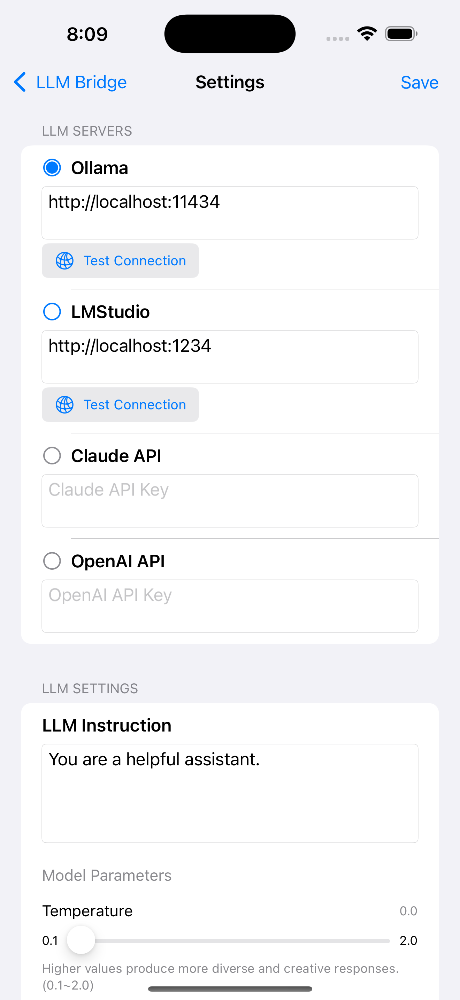
  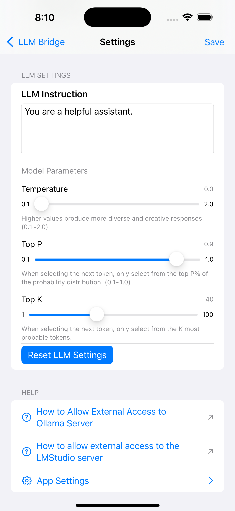
  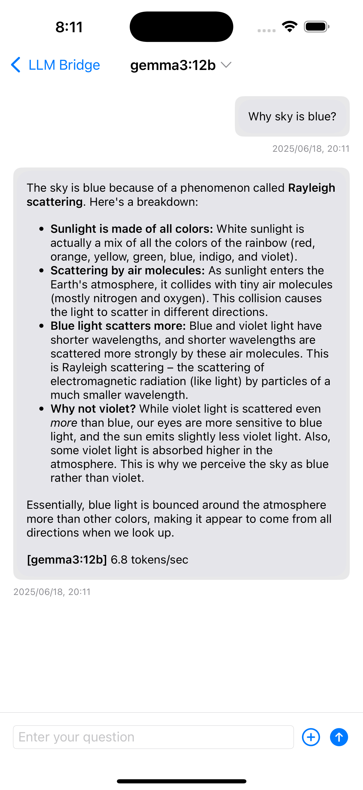
  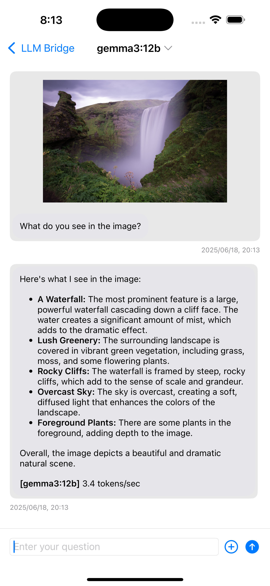
  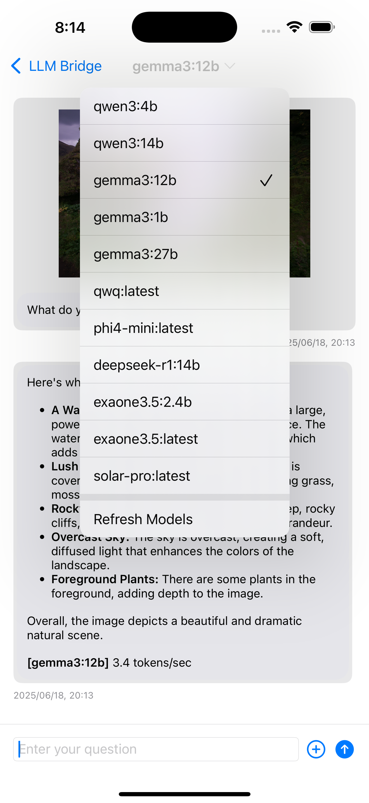
  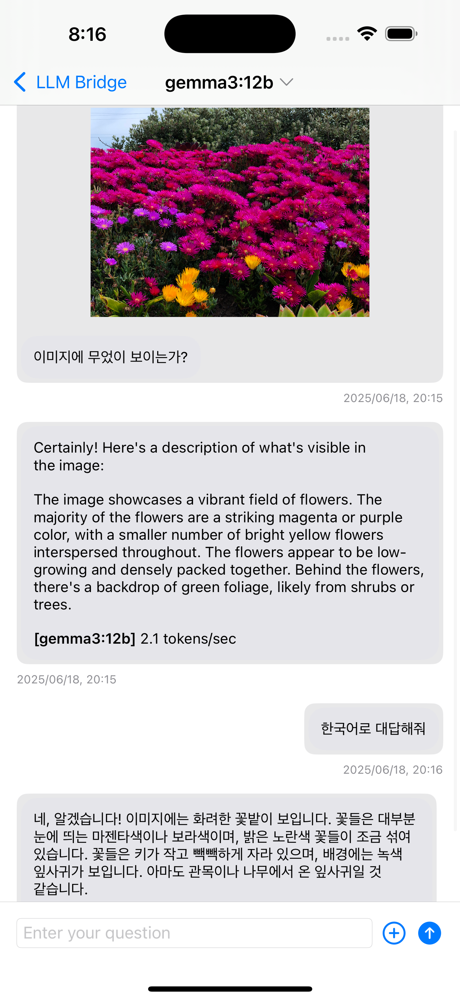
  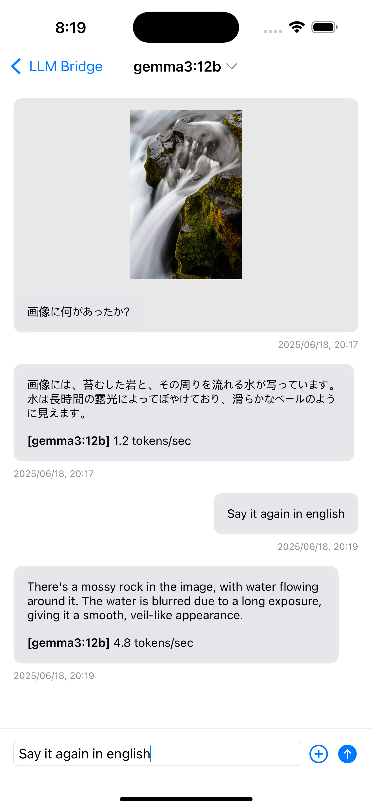
  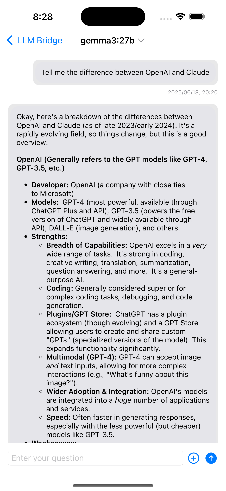
  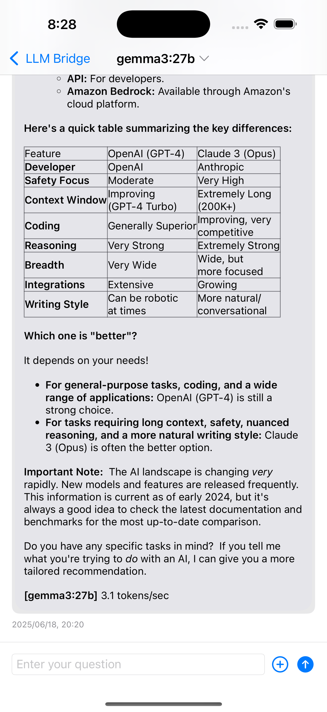
  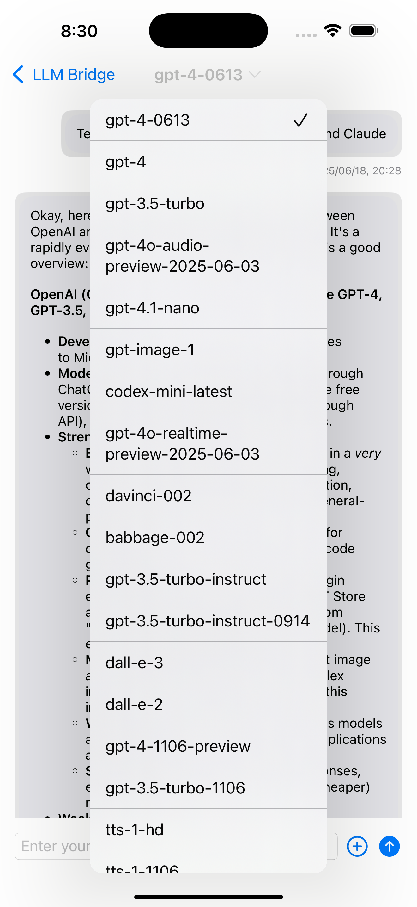

## 使用方法

### 1. 好みのLLMプラットフォームを選択:
* **Ollama**: コンピュータにOllamaをインストール（[Ollamaダウンロード](https://ollama.com/download)）
* **LM Studio**: LM Studioをインストール（[LM Studioウェブサイト](https://lmstudio.ai)）
* **Claude/OpenAI**: 各プラットフォームからAPIキーを取得

### 2. アプリをダウンロード:
* ソースをダウンロードしてXcodeでビルドするか、
* App StoreからLLM Bridgeアプリをダウンロード

### 3. 選択したプラットフォームを設定:
* **Ollama/LM Studio**: 希望するモデルをインストール
* **Claude/OpenAI**: 設定でAPIキーを入力

### 4. ローカルLLM（Ollama/LM Studio）の場合:
* 必要に応じてリモートアクセスを設定

### 5. LLM Bridgeを起動:
* 好みのサービスとモデルを選択
* 会話を開始！

## システム要件

### macOS要件:
- macOS 12.0（Monterey）以上
- ローカルLLM: OllamaまたはLM Studioがインストールされたコンピュータ
- クラウドLLM: ClaudeまたはOpenAIの有効なAPIキー
- ネットワーク接続

### iOS要件:
- iOS 15.0以上
- ローカルLLM: 同じネットワーク内にOllamaまたはLM Studioがインストールされたコンピュータ
- クラウドLLM: ClaudeまたはOpenAIの有効なAPIキー
- Wi-Fiまたはセルラー接続

## 利点

* **ローカルとクラウドベースのLLM両方をサポート**
* **ストリーミングインターフェースのための柔軟なサービス選択**
* **様々なプラットフォームを通じた高度なAI機能**
* **プライバシー保護オプション（ローカルLLM）**
* **プログラミング、創作作業、一般的な質問など多用途**
* **体系的な会話管理**

## 技術的特徴

### アーキテクチャ
- **SwiftUI**: 現代的な宣言的UIフレームワーク
- **Combine**: 反応的プログラミングフレームワーク
- **Async/Await**: 非同期タスク処理
- **Core Data**: ローカルデータ保存と管理

### ネットワーキング
- **URLSession**: 効率的なHTTP通信
- **Server-Sent Events**: リアルタイムストリーミング応答
- **JSON**: 標準データ交換形式
- **Base64**: 画像エンコーディング

### セキュリティ
- **HTTPS**: 安全な通信
- **APIキー管理**: 安全な認証情報保存
- **ローカル処理**: ローカルLLMサポートによるプライバシー保護

## 注意事項

* ローカルLLM機能にはOllamaまたはLM Studioのインストールが必要です
* ClaudeおよびOpenAIサービスにはAPIキーが必要です
* ローカルLLMホストとAPIキーを安全に管理するのはユーザーの責任です

## アプリダウンロード

ビルドに困難がある場合は、以下のリンクからアプリをダウンロードできます。

* **macOS**: [Mac App Store](https://apps.apple.com/us/app/mac-ollama-client/id6741420139)
* **iOS**: [App Store](https://apps.apple.com/us/app/llm-bridge-multi-llm-client/id6738298481?platform=iphone)

## ライセンス

LLM BridgeはGNUライセンスの下で提供されています。詳細についてはLICENSEファイルを参照してください。

## お問い合わせ

LLM Bridgeに関する質問やバグレポートは、rtlink.park@gmail.comまでメールでお送りください。

## 貢献

このプロジェクトはオープンソースで、貢献を歓迎します。バグレポート、機能リクエスト、プルリクエストを通じてプロジェクトの改善にご協力ください。

## 変更履歴

詳細な変更については[changelog.md](changelog.md)を参照してください。

---

**LLM Bridge** - 様々なLLMを橋渡しするマルチプラットフォームクライアント 