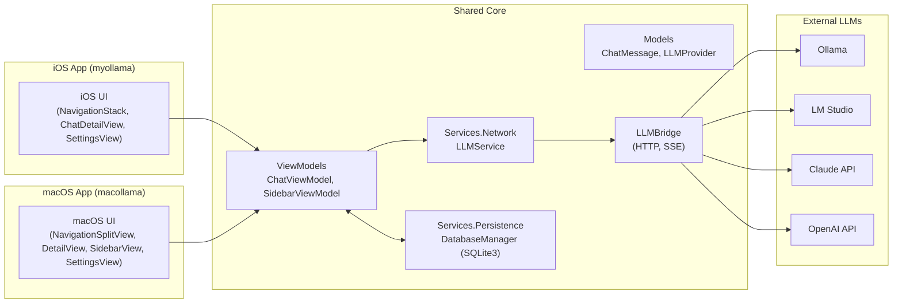

## Architecture Diagram

아키텍처 개요를 Mermaid로 시각화했습니다.

```mermaid
graph LR
subgraph "iOS App (myollama)"
IOS["iOS UI<br/>(NavigationStack, ChatDetailView, SettingsView)"]
end
subgraph "macOS App (macollama)"
MAC["macOS UI<br/>(NavigationSplitView, DetailView, SidebarView, SettingsView)"]
end
subgraph "Shared Core"
MODELS["Models<br/>ChatMessage, LLMProvider"]
VM["ViewModels<br/>ChatViewModel, SidebarViewModel"]
SERV["Services.Network<br/>LLMService"]
BR["LLMBridge<br/>(HTTP, SSE)"]
DB["Services.Persistence<br/>DatabaseManager (SQLite3)"]
end
subgraph "External LLMs"
OLL["Ollama"]
LMS["LM Studio"]
CLA["Claude API"]
OAI["OpenAI API"]
end
IOS --> VM
MAC --> VM
VM --> SERV
SERV --> BR
BR --> OLL
BR --> LMS
BR --> CLA
BR --> OAI
VM <--> DB
```

