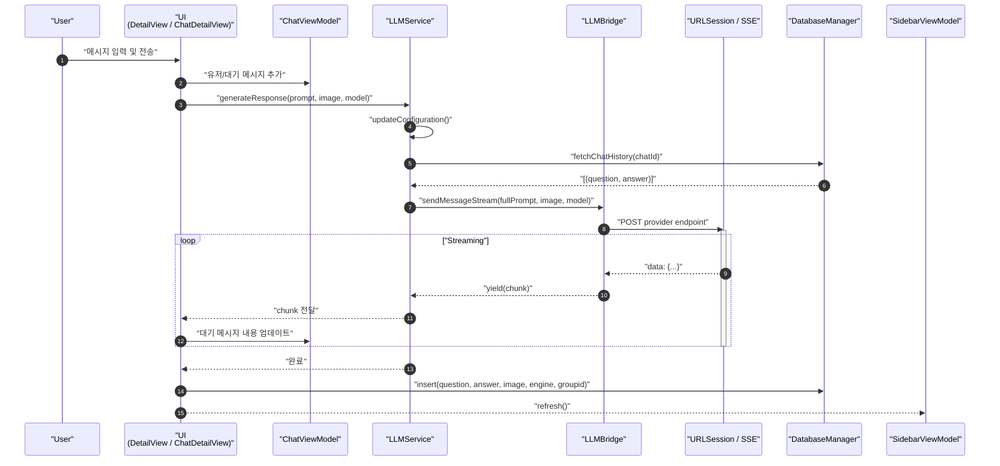

## Sequence Diagram

메시지 전송부터 스트리밍 수신, 저장까지의 흐름을 Mermaid 시퀀스로 표현했습니다.

```mermaid
sequenceDiagram
autonumber
participant U as "User"
participant UI as "UI<br/>(DetailView / ChatDetailView)"
participant VM as "ChatViewModel"
participant S as "LLMService"
participant B as "LLMBridge"
participant HTTP as "URLSession / SSE"
participant DB as "DatabaseManager"
participant SV as "SidebarViewModel"

U ->> UI: "메시지 입력 및 전송"
UI ->> VM: "유저/대기 메시지 추가"
UI ->> S: "generateResponse(prompt, image, model)"
S ->> S: "updateConfiguration()"
S ->> DB: "fetchChatHistory(chatId)"
DB -->> S: "[(question, answer)]"
S ->> B: "sendMessageStream(fullPrompt, image, model)"
B ->> HTTP: "POST provider endpoint"
activate HTTP
loop "Streaming"
	HTTP -->> B: "data: {...}"
	B -->> S: "yield(chunk)"
	S -->> UI: "chunk 전달"
	UI ->> VM: "대기 메시지 내용 업데이트"
end
deactivate HTTP
S -->> UI: "완료"
UI ->> DB: "insert(question, answer, image, engine, groupid)"
UI -->> SV: "refresh()"
```

